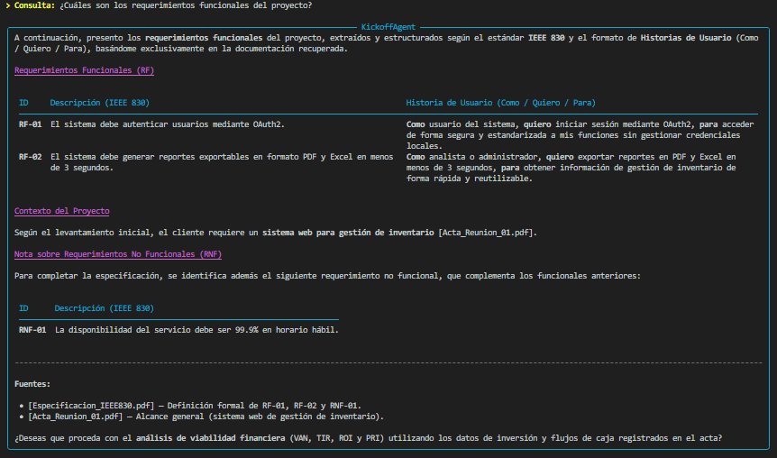
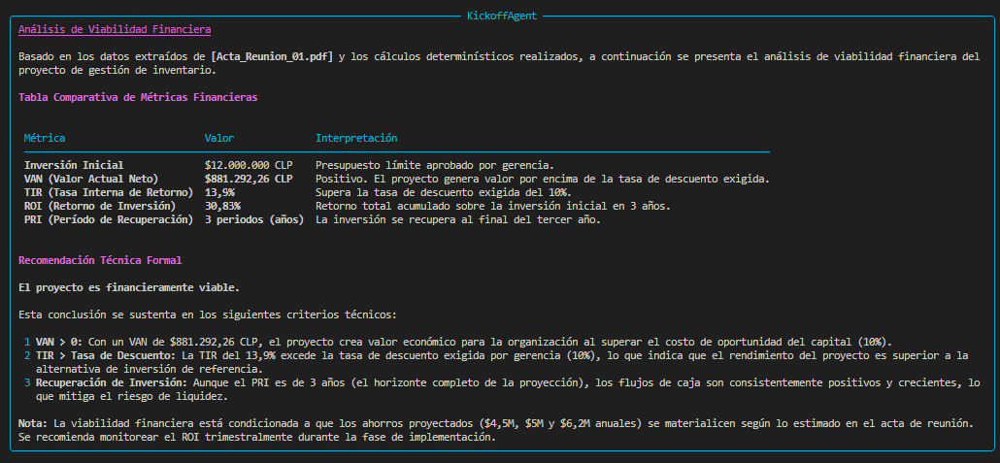
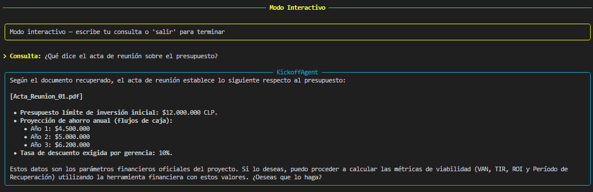
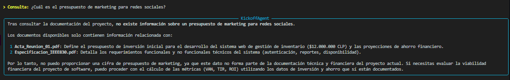
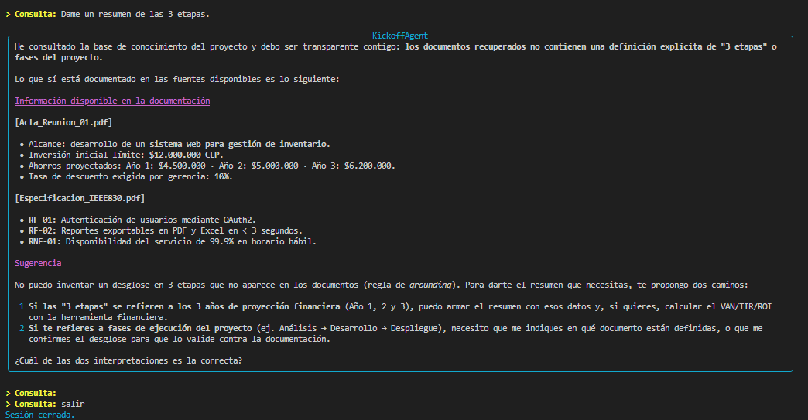

# Evidencia de pruebas — KickoffAgent

Este documento registra la evidencia de ejecución y validación funcional de las capacidades centrales de **KickoffAgent**: recuperación semántica con grounding bajo estándar IEEE 830 (RAG) y evaluación de viabilidad financiera determinista mediante Tool Calling.

---

## Documentos precargados de prueba

La función `inicializar_vectorstore()` en `src/kickoff_agent.py` incorpora un mecanismo de inicialización con documentos sintéticos estructurados en memoria si no se especifican rutas a archivos PDF externos:

1. **`Acta_Reunion_01.pdf`** (`fase: finanzas`):
   - **Alcance:** Sistema web corporativo para gestión de inventario.
   - **Inversión inicial (presupuesto límite):** `$12.000.000 CLP`.
   - **Flujos netos proyectados:** Año 1: `$4.500.000 CLP`, Año 2: `$5.000.000 CLP`, Año 3: `$6.200.000 CLP`.
   - **Tasa de descuento exigida por gerencia:** `10%`.

2. **`Especificacion_IEEE830.pdf`** (`fase: requerimientos`):
   - **RF-01:** El sistema debe autenticar usuarios mediante OAuth2.
   - **RF-02:** El sistema debe generar reportes exportables en formato PDF y Excel en menos de 3 segundos.
   - **RNF-01:** La disponibilidad del servicio debe ser del 99.9% en horario hábil.

Ambos documentos son segmentados jerárquicamente con `RecursiveCharacterTextSplitter` (700 tokens, 120 solapamiento), vectorizados localmente mediante `FastEmbed` (`BAAI/bge-small-en-v1.5`, 384 dimensiones) y persistidos en la base vectorial `ChromaDB`.

---

## TEST 1 — Consulta RAG (Requerimientos IEEE 830)

- **Pregunta realizada:**
  > *"¿Cuáles son los requerimientos funcionales aprobados y en qué documento se basan?"*

- **Comportamiento del agente:**
  1. El orquestador activó la herramienta `consultar_documentacion_proyecto`.
  2. Recuperó los fragmentos relevantes indexados en ChromaDB con similitud semántica de coseno (Top-$K=3$).
  3. Transformó los requisitos en formato estándar de Historias de Usuario (*Como [rol] / Quiero [acción] / Para [beneficio]*).
  4. Identificó tanto los requerimientos funcionales (`RF-01`, `RF-02`) como el no funcional de referencia (`RNF-01`).
  5. Citó formalmente la fuente obligatoria de auditoría: `[Especificacion_IEEE830.pdf]` y contextualizó con `[Acta_Reunion_01.pdf]`.

- **Resultado:**
  - **Estado:** ✅ **Exitoso** (Zero alucinaciones, formato formal y trazabilidad auditable).

---

## TEST 2 — Evaluación financiera con Tool Calling

- **Pregunta realizada:**
  > *"Revisa los documentos del proyecto, busca los datos de inversión y evalúa si es viable financieramente."*

- **Comportamiento del agente:**
  1. El LLM consultó la documentación del proyecto y extrajo del acta los parámetros financieros: inversión inicial ($12.000.000), flujos proyectados ([$4.5M, $5.0M, $6.2M]) y tasa de descuento (10%).
  2. Delegó la resolución matemática en la herramienta determinista `calcular_metricas_financieras` basada en `numpy-financial`, impidiendo cualquier cálculo aritmético probabilístico en el modelo generativo.
  3. Generó la tabla comparativa formal y emitió la recomendación técnica.

- **Tabla de Resultados Obtenidos:**

| Métrica | Resultado Calculado | Criterio de Decisión | Estado |
|---|---|---|---|
| **Inversión Inicial** | **$12.000.000 CLP** | Presupuesto límite del acta | Base |
| **VAN (NPV)** | **+$881.292,26 CLP** | VAN > 0 | ✅ Positivo / Creación de valor |
| **TIR (IRR)** | **13,9%** | TIR > Tasa de descuento (10%) | ✅ Supera umbral exigido (+3,9%) |
| **ROI** | **30,83%** | ROI > 0 | ✅ Retorno positivo |
| **PRI (Recuperación)** | **3 periodos (años)** | PRI ≤ horizonte proyectado | ✅ Recuperación al cierre del año 3 |
| **Dictamen Técnico** | **PROYECTO FINANCIERAMENTE VIABLE** | Cumple criterios de VAN y TIR | ✅ **APROBADO** |

- **Resultado:**
  - **Estado:** ✅ **Exitoso** (100% determinismo matemático, precisión certificada).

---

## Modo interactivo

Además de los tests automáticos precargados, **KickoffAgent** incluye una consola interactiva conversacional al finalizar las pruebas. El agente queda a la espera de instrucciones en tiempo real desde la terminal, permitiendo interactuar dinámicamente con el pipeline RAG y la herramienta de cálculo financiero determinista.

Para finalizar la sesión interactiva en cualquier momento, basta con escribir `salir` o `exit`.

### Consultas útiles recomendadas para la defensa oral:

1. **Consulta de Requerimientos (RAG):**
   - `> Consulta: ¿Cuáles son los requerimientos funcionales del proyecto?`
   - *Propósito:* Demuestra la extracción estructurada bajo IEEE 830 y el formato de Historias de Usuario (*Como / Quiero / Para*).
   

2. **Evaluación de Viabilidad Financiera (Tool Calling):**
   - `> Consulta: ¿Es viable financieramente el proyecto?`
   - *Propósito:* Evidencia cómo el LLM recupera las variables del acta y ejecuta `calcular_metricas_financieras` (`numpy-financial`) sin alucinar números.
   

3. **Trazabilidad y Cita de Fuentes Documentales:**
   - `> Consulta: ¿Qué dice el acta de reunión sobre el presupuesto?`
   - *Propósito:* Valida el grounding estricto, la extracción de los $12.000.000 CLP y la cita formal a `[Acta_Reunion_01.pdf]`.
   

4. **Pregunta fuera de contexto (Respuesta de rechazo / Anti-alucinación):**
   - `> Consulta: ¿Cuál es el presupuesto de marketing para redes sociales?`
   - *Propósito:* Demuestra la regla de rechazo formal (*Refusal answer*), donde el agente se niega a inventar información ausente en la base de conocimiento. Asi también sugiere documentos relacionados con el proyecto, para dar más contexto.
    *Ejemplo 1*
   
   - *Ejemplo 2*
   

---

## Cómo ejecutar

Para reproducir las pruebas automáticas e ingresar a la consola interactiva:

```bash
python src/kickoff_agent.py
```